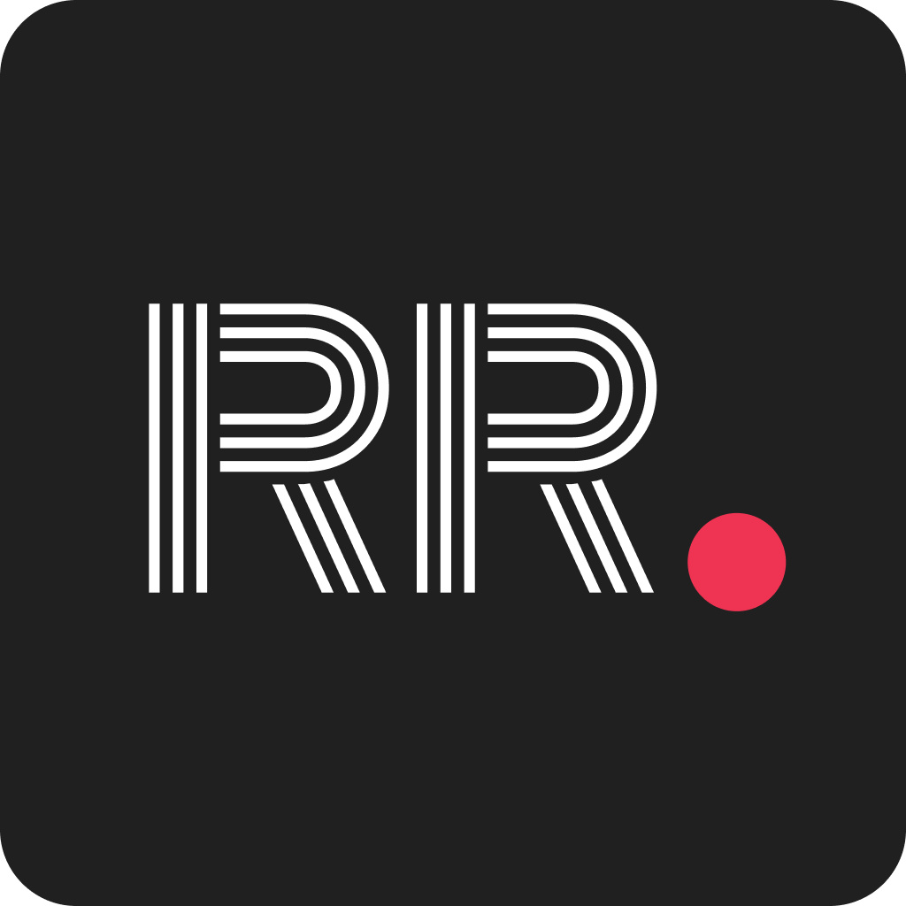

<!-- PROJECT LOGO -->
<br />


<h6 align="center">Pieter Venter IOS Introduction 303</h6>
<p align="center">
</br>
   
  <a href="https://github.com/Pieter-stack/RecordRoom">
    
  </a>
  
  <h3 align="center">RecordRoom</h3>

  <p align="center">
    A fun retro-looking music app coming your way! Record Room is a music player application. With a few clicks and swipes you will be able to search, pause, play, forward and rewind your favourite music, anytime and anywhere.
Add albums to your favourites, have a detailed album view and toggle between lightmode and darkmode! 
<br>
      <a href="https://github.com/Pieter-stack/RecordRoom"><strong>Explore the docs »</strong></a>
      <br />
      <br />
      <a href="add video">View Demo</a>
       ·
       <a href="https://github.com/Pieter-stack/RecordRoom/issues">Report Bug</a>
       ·
       <a href="https://github.com/Pieter-stack/RecordRoom/issues">Request Feature</a>
   </p>

<!-- TABLE OF CONTENTS -->
## Table of Contents

* [About the Project](#about-the-project)
  * [Project Description](#project-description)
  * [Built with](#built-with)
* [Getting Started](#getting-started)
  * [Prerequisites](#prerequisites)
  * [Installation](#installation)
* [Features and Functionality](#features-and-functionality)
   * [Features](#features)
   * [Functionality](#functionality)
* [Concept Process](#concept-process)
   * [Ideation](#ideation)
   * [Wireframes](#wireframes)
   * [User-flow](#user-flow)
* [Development Process](#development-process)
   * [Implementation Process](#implementation-process)
        * [Highlights](#highlights)
        * [Challenges](#challenges)
   * [Reviews and Testing](#reviews-and-testing)
   * [Future Implementation](#future-implementation)
* [Final Outcome](#final-outcome)
   * [Mockups](#mockups)
   * [Promotional Video](#promotional-video)
* [Roadmap](#roadmap)
* [Contributing](#contributing)
* [License](#license)
* [Contact](#contact)
* [Acknowledgements](#acknowledgements)

<!--PROJECT DESCRIPTION-->
## About the Project

![image1][image1]

### Project Description
This app is designed and developed to play music. It allows the user to interact with the typical music player features like; pause, play, rewind & forward songs. Record Room gives the user the ability to search for albums and also to filter through it by genre. 

Record Room also offers other music player functions like adding albums you like to your favourites, easier access to your favourite songs that have been added to your “Favourite Playlist”. The app showcases all the artists songs in one of their albums which allows the user to have a detailed album view. 

Record Room has a settings page that gives the user a short description of the app and who the Developer is. Also on the settings page is a button that allows the user to toggle between the option of Lightmode or Darkmode. 

Lastly Record Room combines a bit of the retro-looking theme with 21st century modern and sleek theme to give a new overall appealing aesthetic differentiating it from all of the other music player apps out there. 


### Built With

* [xcode](https://developer.apple.com/xcode/)
* [SwiftUI](https://developer.apple.com/xcode/swiftui/)
* [GitHub](https://github.com/)

&nbsp;&nbsp;&nbsp;&nbsp;&nbsp;&nbsp;&nbsp;&nbsp;
&nbsp;&nbsp;&nbsp;&nbsp;&nbsp;&nbsp;&nbsp;&nbsp;
&nbsp;&nbsp;&nbsp;&nbsp;&nbsp;&nbsp;&nbsp;&nbsp;

<!-- GETTING STARTED -->
## Getting Started

These instructions will get you a copy of the project up and running on your local machine for development and testing purposes.

### Prerequisites

For development, the latest version of Visual Studio is required. The latest version can be downloaded from [Xcode](https://developer.apple.com/xcode/)

### Installation
 
1. Clone the repo
```sh
git clone https://github.com/Pieter-stack/RecordRoom.git
```
2. Open the project

  Locate and drag file into xcode.

3. Run project

```sh
Choose simulator and press play button in top left corner
```

<!-- FEATURES AND FUNCTIONALITY-->
## Features and Functionality

### Features

### Song List.

![image2][image2]

See a list of songs within each album

### Onboarding screens. 

![image6][image6]

Onboarding experience for user to explain what the app offers

### Library screen.

![image7][image7]

See a list of albums and favourite albums

### Play Music.

![image4][image4]

Play pause, skip and rewind tracks

### Filter songs per album name or by genre.


![image3][image3]

You can search for spesific albums or you can filter albums by genre

### Settings screen.

![image5][image5]

Choose between light and dark mode in the settings


### Artwork and designs created by me

The artwork was created with Figma.

### Functionality

* `Music` can be played on the app from multiple different albums and also can be played while phone is on silent.
* `Search` for your favourite albums with the searchbar or filter by genre.
* `Favourite` albums for easier access when you open the app.
* `Light and Dark` Mode in the settings.

<!-- CONCEPT PROCESS -->
## Concept Process

The `Conceptual Process` is the set of actions, activities and research that was done when starting this project.

### Ideation

![image10][image10]

### Wireframes

![image8][image8]

### User-flow

![image9][image9]

<!-- DEVELOPMENT PROCESS -->
## Development Process

The `Development Process` is the technical implementations and functionality done in the backend of the application.

### Implementation Process

#### Design Architecture
`React native` to design the pages used in Topshots.

#### Highlights

* One highlight was to `research`  music and find different ways of implementing music within the app.
* The `UI/UX design` was designed for the user to quickly find all of the music on one page.
* The best part was to load the app onto a `real device` and play music from the app.

#### Challenges

* Was a challenge to find and setup sound and music within the project but at the end everything worked out good.

#### Future Implementation

* Add `more music` to the app.
* Have cooler `music` integrations.

<!-- MOCKUPS -->
## Final Outcome

### Mockups

![image11][image11]

<!-- PROMO VIDEO -->
## Promotional Video

To see the promotional video, click below:

[View Promotional Video](https://www.youtube.com/watch?v=vvu9OxefnRk)

<!-- ROADMAP -->
## Roadmap

See the [open issues](https://github.com/Pieter-stack/RecordRoom/issues) for a list of proposed features (and known issues).

<!-- CONTRIBUTING -->
## Contributing

Contributions are what make the open source community such an amazing place to be learn, inspire, and create. Any contributions you make are **greatly appreciated**.

1. Fork the Project
2. Create your Feature Branch (`git checkout -b feature/AmazingFeature`)
3. Commit your Changes (`git commit -m 'Add some AmazingFeature'`)
4. Push to the Branch (`git push origin feature/AmazingFeature`)
5. Open a Pull Request

<!-- AUTHORS -->
## Authors

* **Pieter Venter** - [PieterVenter](https://github.com/Pieter-stack)

<!-- LICENSE -->
## License

Distributed under the MIT License. See `LICENSE` for more information.\

<!-- LICENSE -->
## Contact

* **Pieter Venter**  - pieterven12@gmail.com
* **Project Link** - https://github.com/Pieter-stack/RecordRoom

<!-- ACKNOWLEDGEMENTS -->
## Acknowledgements

* [Youtube Jared Davidson](https://www.youtube.com/c/Archetapp)
* [Youtube Kavsoft](https://www.youtube.com/c/Kavsoft)
* [Mockups](https://www.freepik.com)
* [Lecturer](https://github.com/ArmandPret)


<!-- MARKDOWN LINKS & IMAGES -->
[image1]: Images/Image1.png
[image2]: Images/Image2.png
[image3]: Images/Image3.png
[image4]: Images/Image4.png
[image5]: Images/Image5.png
[image6]: Images/Image6.png
[image7]: Images/Image7.png
[image8]: Images/Image8.png
[image9]: Images/Image9.png
[image10]: Images/Image10.png
[image11]: Images/Image11.png

 
